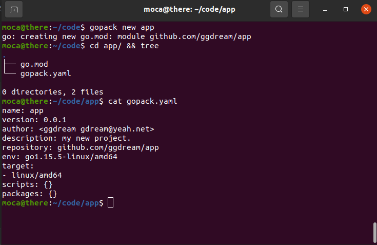
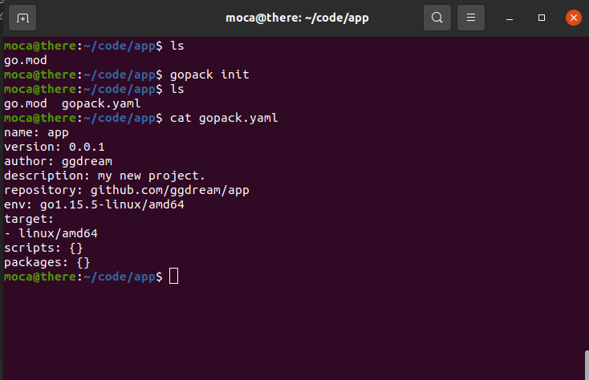
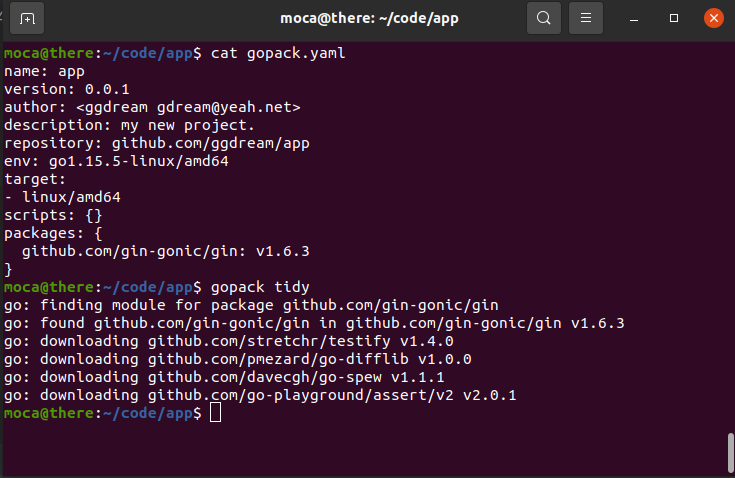
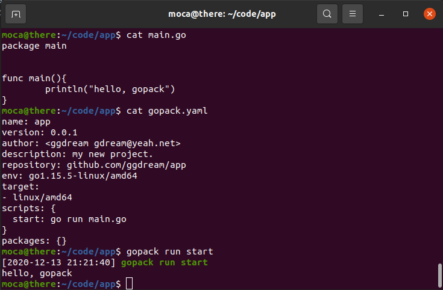
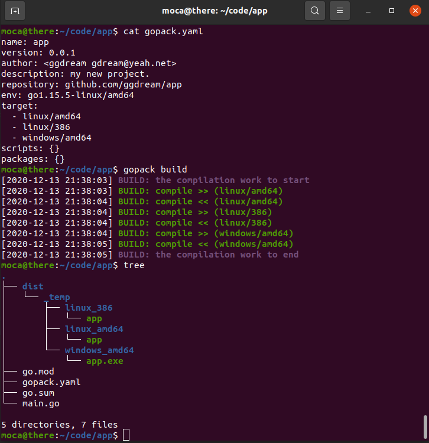
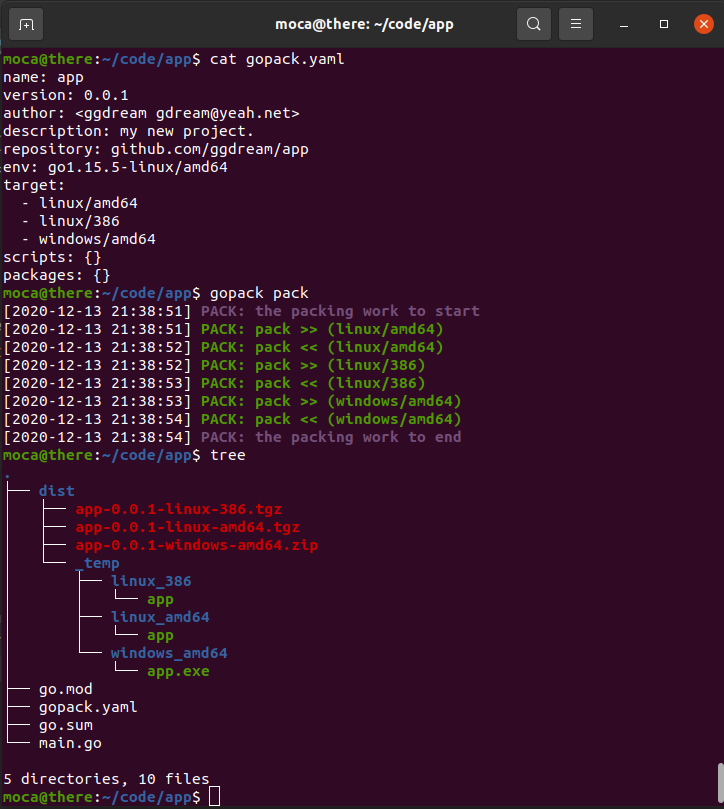

# gopack  

1. [项目文档](#项目文档)
2. [更新说明](docs/update.md)
3. [使用实例](docs/example.md)

# 使用实例
1. new：创建新项目
   > 通过-t这一局部参数可设置配置文件格式(在json、yaml和toml间选择)
   
    

2. init：为已有项目创建配置文件
   > 通过-t这一局部参数可设置配置文件格式(在json、yaml和toml间选择)
   
    

3. tidy：整理并更新包依赖
    

4. run：执行在配置文件里定义的脚本命令
    
   
5. build：编译项目为可执行文件
    
   
6. pack：编译项目为可执行文件并压缩
    

# 项目文档
待编写
